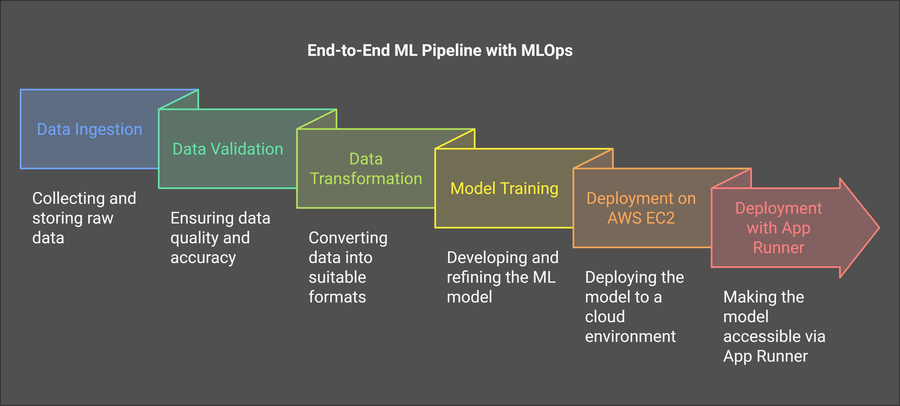

# End-to-End-Machine-Learning-Project-with-MLFLOW

## Overview

This project is a complete implementation of an End-to-End Machine Learning Pipeline with MLOps principles, covering data ingestion, validation, transformation, model training, and deployment on AWS EC2 with App Runner. The primary goal is to build, train, and deploy a robust ML model while adhering to MLOps best practices.


## Features

- Scalable Architecture: Structured project organization for easy scalability and maintenance.
- MLOps Integration: Incorporates tools for model tracking and deployment.
- Automation: Automated pipelines for data handling and model deployment.
- Deployment: Deployed on AWS EC2 with App Runner for production-level serving.

## Workflow Description 

## Workflow Description 



## Installation

1. Clone the repository:
    ```sh
    git clone https://github.com/dipan97-hue/End-to-End-Machine-Learning-Project-with-MLFLOW 
  
    ```
2. Set up Virtual Environment:
    ```sh
    python -m venv venv
    .\venv\Scipts\activate

    ```
3. Install the required dependencies:
    ```sh
    pip install -r requirements.txt
    ```
4. Run the program:
    ```sh
    python main.py
    ```
5. Run the Webapp and test yourself:
    ```sh
    python app.py
    ```


### dagshub 
[dagshub](https://dagshub.com)
 ```sh
import dagshub
dagshub.init(repo_owner='dipan97-hue', repo_name='End-to-End-Machine-Learning-Project-with-MLFLOW', mlflow=True)

import mlflow
with mlflow.start_run():
  mlflow.log_param('parameter name', 'value')
  mlflow.log_metric('metric name', 1)
  
```

## Contributing

Contributions are welcome! Please open an issue or submit a pull request for any changes.

## License

This project is licensed under the MIT License.